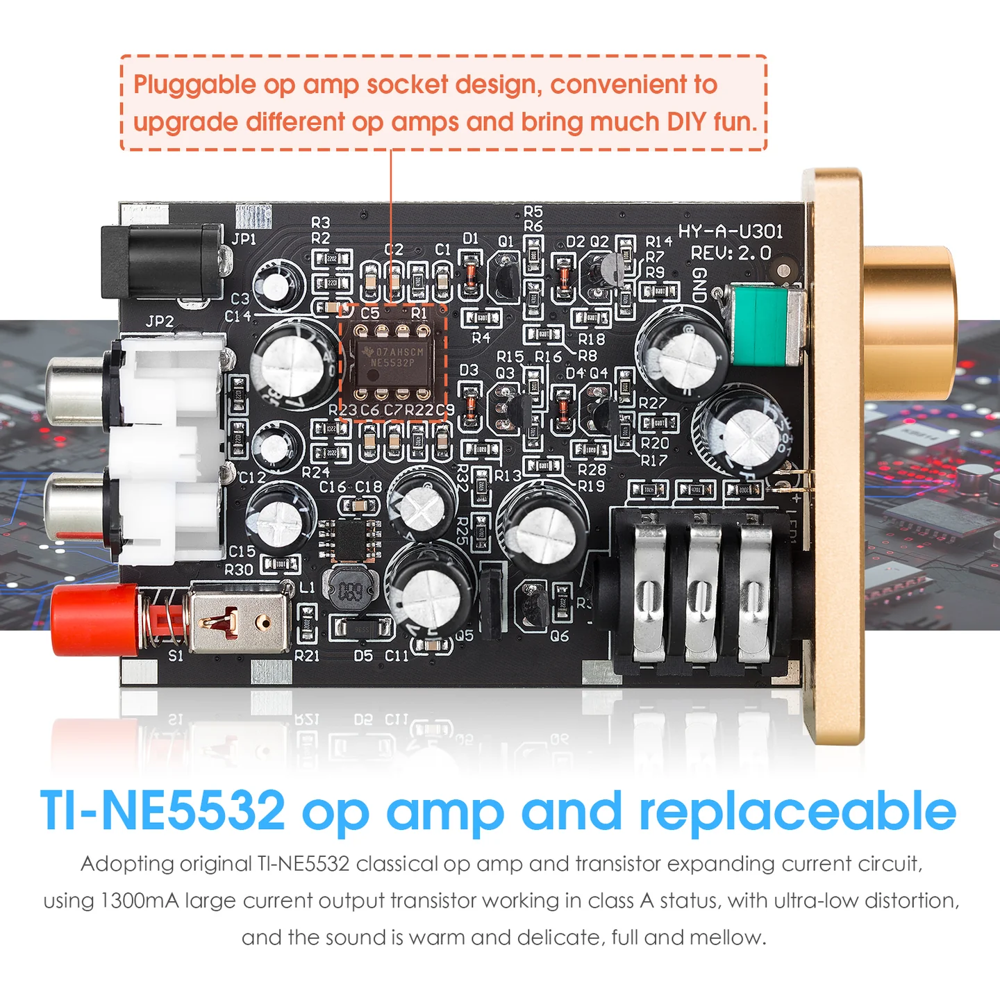
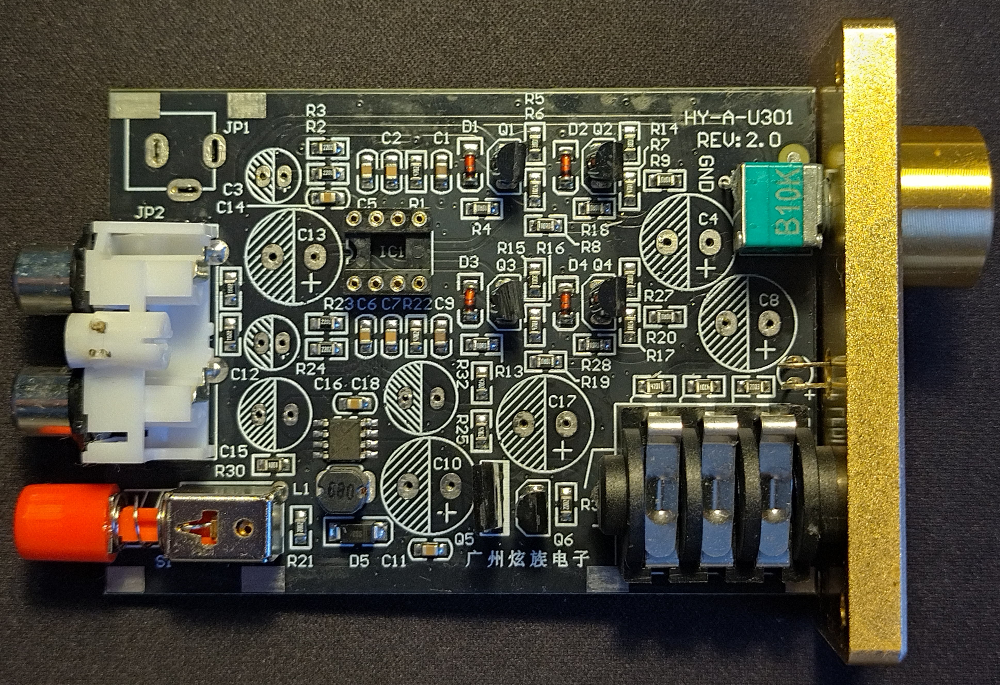
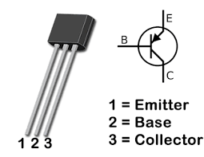
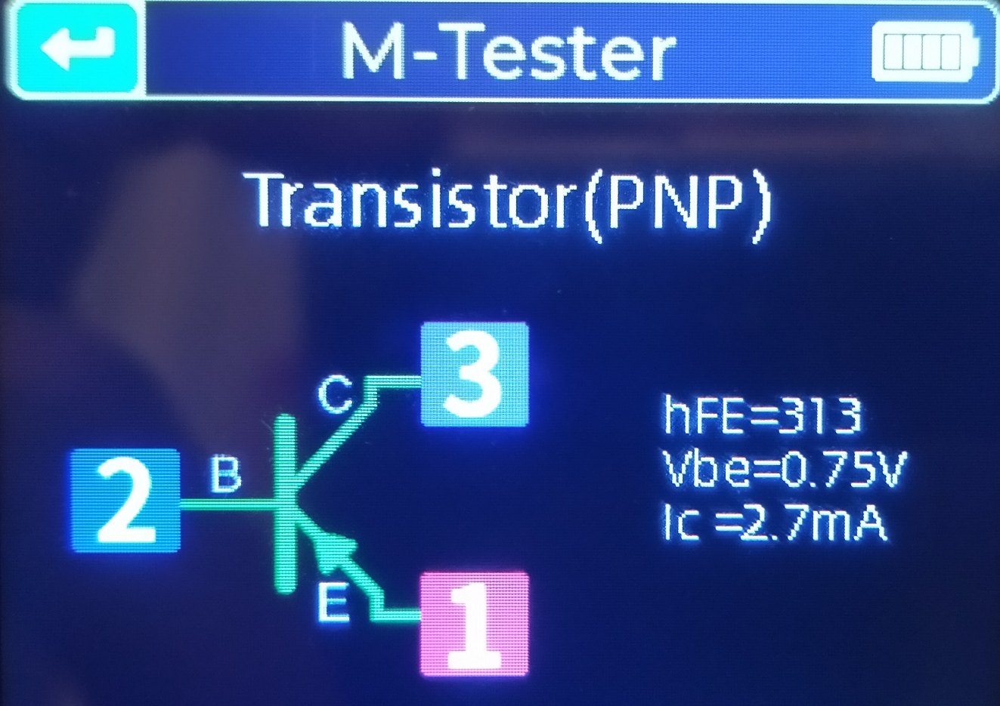
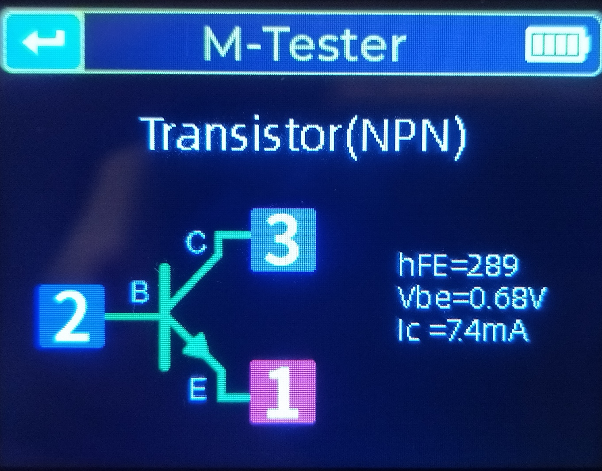
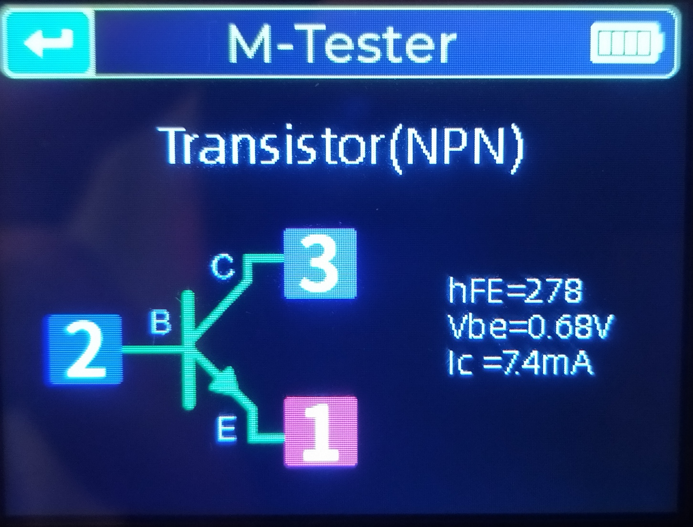
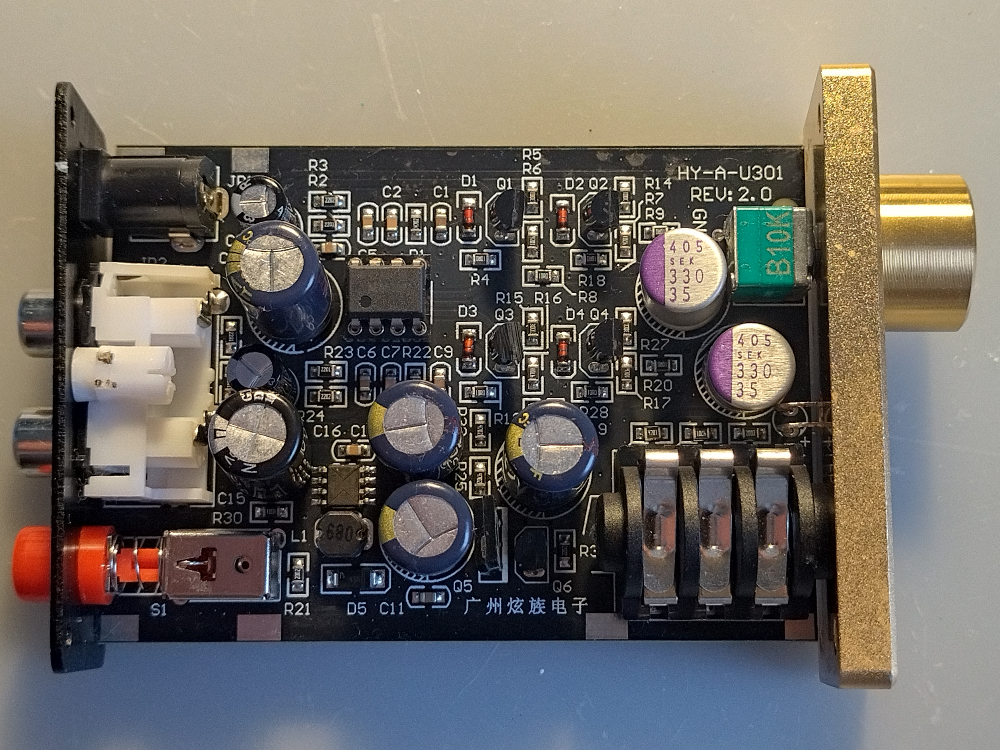
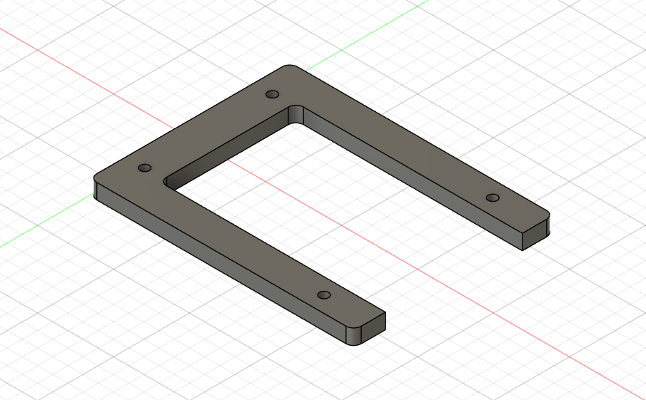
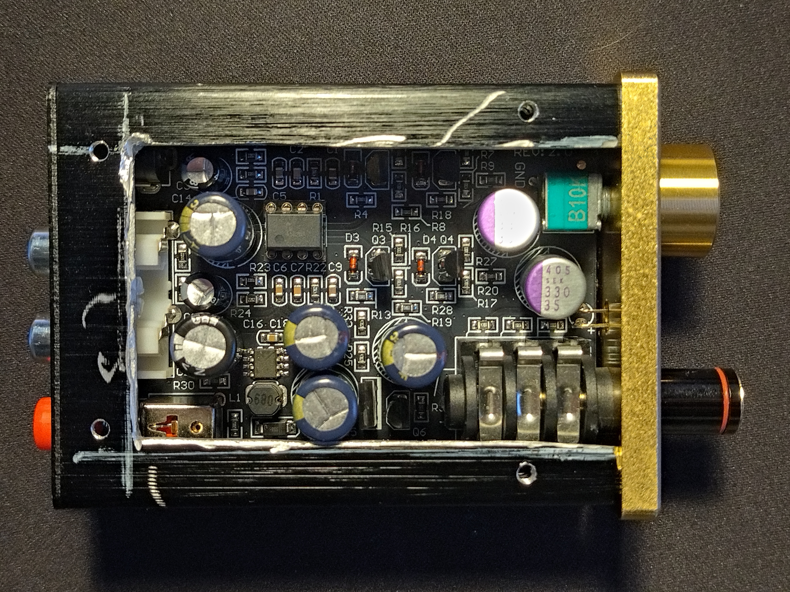

# Douk Audio U3

A dedicated page for reverse-engineering the Douk Audio U3 headphone amp.

## PCB

_original top view_

_desoldered top view_

## Capacitors

### Original Capacitor Values

 ID | Type
 -- | ----
C3 | 47uF 25V electrolytic (Jwco PET)
C13 | 470uF 35V electrolytic (Jwco VENT)
C12 | 47uF 25V electrolytic (Jwco PET)
C15 | 470uF 25V electrolytic (Jwco VENT)
C18 | 470uF 25V electrolytic (Jwco VENT)
C10 | 470uF 35V electrolytic (Jwco VENT)
C17 | 470uF 35V electrolytic (Jwco VENT)
C4 | 470uF 35V electrolytic (Jwco VENT)
C8 | 470uF 35V electrolytic (Jwco VENT)

## Transistors

### Original Transistor Values

 ID | Type
 -- | ----
Q1 | NPN hFE=278, Vbe=0.68V, Ic=7.4mA
Q2 | PNP hFE=313, Vbe=0.75V, Ic=2.7mA
Q3 | NPN hFE=289, Vbe=0.68V, Ic=7.4mA
Q4 | PNP hFE=315, Vbe=0.74V, Ic=2.7mA

### Transistor Pinout

All transistors were measured by their flat side facing downwards.

## Modifications

### OP-AMP

Using LM4562 OP-AMP as a replacement of the original TI-NE5532 ([datasheet](https://www.ti.com/lit/ds/symlink/lm4562.pdf?ts=1767798031264&ref_url=https%253A%252F%252Fwww.ti.com%252Fproduct%252FLM4562)).

### Capacitors

 ID | Type
 -- | ----
C3 | 47uF 63V LOW ESR electrolytic (Panasonic)
C13 | 470uF 35V LOW ESR, low impedance electrolytic (Panasonic)
C12 | 47uF 63V LOW ESR electrolytic (Panasonic)
C15 | 1000uF 25V LOW ESR, low impedance electrolytic (SAMXON)
C18 | 470uF 35V LOW ESR, low impedance electrolytic (Panasonic)
C10 | 470uF 35V LOW ESR, low impedance electrolytic (Panasonic)
C17 | 470uF 35V LOW ESR, low impedance electrolytic (Panasonic)
C4 | 330uF 35V low impedance polymer (Panasonic SEK)
C8 | 330uF 35V low impedance polymer (Panasonic SEK)

### Top

The higher capacitors don't fit into the old case, so I decided to cut of the top of the case and repliace it with plexiglass.
You can 3D print the top case extension and use it as a teplate to drill threaded holes to fasten the plexiglass sheet.

[STL file for the extension](stl/raiser.stl)

## References

### Manual

[Douk U3 Manual](https://github.com/gitaroktato/douk-u3/blob/main/manual/XZ-U3-English%20Manual.pdf)

### Modifications by Others

- <https://yama-audiolab-0910e.blog.jp/archives/18373911.html>
- <https://yama-audiolab-0910e.blog.jp/archives/18514568.html>
- <https://yama-audiolab-0910e.blog.jp/archives/18852685.html>
- <https://www.superbestaudiofriends.org/index.php?threads/douk-audio-u3-review-the-douk-of-wishful-thinking.13953/>
- <https://www.head-fi.org/threads/douk-u3-mini-headphone-amp-question-on-power-supply-voltage-amp-rating.953409/>

**Videos**

- <https://www.youtube.com/watch?v=0_Y2Y3yej60>
- <https://www.youtube.com/watch?v=qaZJLgjyqSM>
